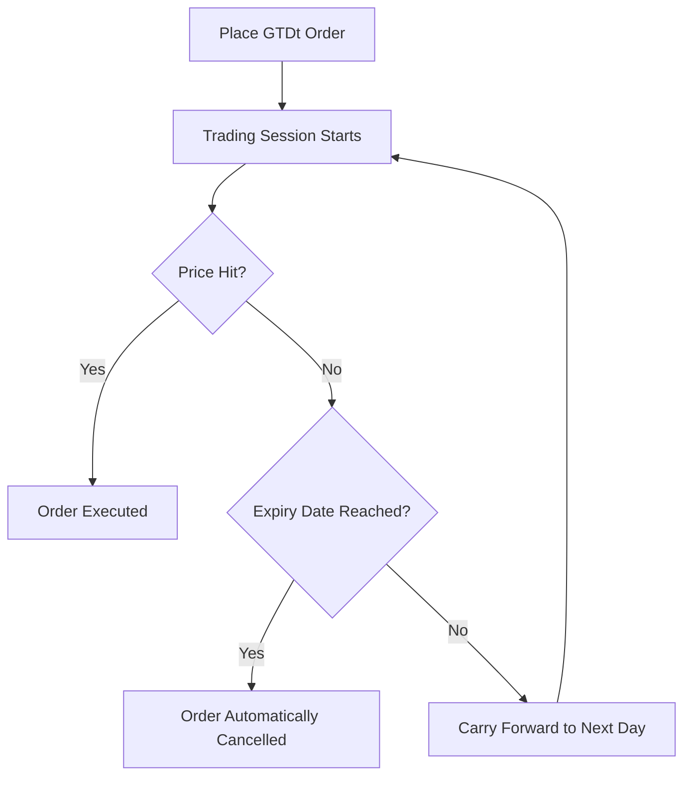

# GTDt (Good Till Date) Orders

A **GTDt (Good Till Date)** order is a specific type of limit order that remains active in the trading system for an extended period, rather than expiring at the end of the current trading day. The lowercase **t** is sometimes used to denote *Time*, implying "Good Till Date and Time."

---

## 🔍 How It Works

Normally, when you place a standard limit order, it is treated as a **Day Order**. If it isn't filled by the closing bell (e.g., 3:30 PM or 4:00 PM), the exchange automatically cancels it.

With a **GTDt** order:
1. **Define Expiry:** You specify a date in the future (most brokers set a maximum limit of **30 to 45 days**).
2. **Persistence:** If the target price is not met on the first day, the broker's system rolls the order forward to the next business day's session.
3. **Execution:** The moment the stock's market price touches or crosses your limit price during trading hours within the specified period, the order executes.
4. **Expiration:** If the date passes without the price being hit, the order expires and is deleted.

---

## ⚖️ Advantages of GTDt Orders

* **Passive Monitoring:** Excellent for long-term investors or swing traders who have a predetermined entry/exit price and do not want to log in daily to manually place orders.
* **Price Discipline:** Prevents emotional trading. You set your desired purchase price when clear-headed, and let the market come to you.
* **No Daily Overhead:** The brokerage system handles the daily placement on the exchange book automatically.

---

## ⚠️ Important Considerations & Risks

> [!WARNING]
> **Corporate Actions**
> If a company undergoes a corporate action such as a stock split, bonus issue, dividend announcement, or merger, pending GTDt orders are typically **cancelled** by the broker. This prevents execution at outdated or incorrect prices.

> [!IMPORTANT]
> **Margin & Fund Requirements**
> Some brokers verify funds at the time of order entry, while others verify them at the moment of execution. You must ensure that sufficient cash or margin is available in your account throughout the GTDt validity period. If funds are insufficient when the price is hit, the order will fail.
